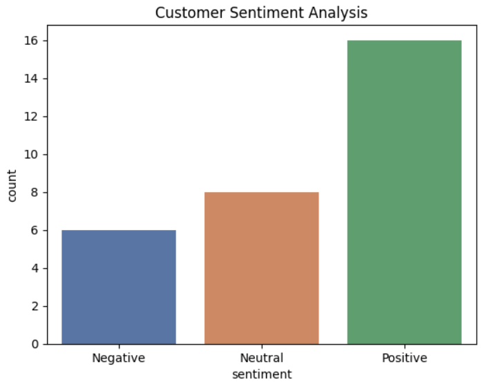

# 📈 UHC Insurance Customer Sentiment Analysis (NLP)

## 🏆 Project Overview
This project leverages Natural Language Processing (NLP) to automate the analysis of customer feedback. By processing unstructured text reviews, the system identifies the overall sentiment "mood" and pinpoints specific operational bottlenecks, identifying **Claim Processing** as the primary driver of dissatisfaction.

## 🛠️ Technical Stack
- **Language:** Python 🐍
- **Libraries:** Pandas, TextBlob (NLP & Sentiment Polarity), Seaborn, Matplotlib
- **Environment:** Google Colab

## 🚀 The Data Workflow

### 1. Data Structuring & Processing
Converted unstructured reviews into a structured Pandas DataFrame. 

Used **TextBlob** to calculate polarity scores ranging from **-1.0 (Negative)** to **+1.0 (Positive)**.

### 2. Logic-Based Classification
Implemented a custom classification engine:
- **Positive:** Score > 0
- **Neutral:** Score = 0
- **Negative:** Score < 0

### 3. Visualization
Generated a distribution plot to visualize the ratio of customer sentiments.

## 💡 Key Business Insight
By isolating the **Negative Sentiment Segment**, the analysis revealed that negative feedback was heavily concentrated around **Claim Delays** and **Confusing Reimbursement Processes**, while general support remained positive.

**Strategic Recommendation:** Prioritize the optimization of the Claims Department workflow to improve overall NPS.
